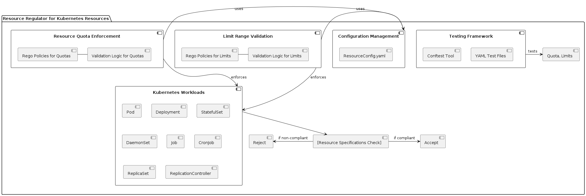

# Resource Regulator for Kubernetes Resources 🛡️

Welcome to the Resource Regulator, an innovative Open Policy Agent (OPA) project designed to ensure fair and effective resource allocation within Kubernetes clusters. This project automates the enforcement of resource quotas and limit ranges, promoting optimal performance and stability across your Kubernetes workloads. 🌟

## Features ✨

- **Resource Quota Enforcement**: Automatically ensures that every namespace adheres to defined CPU, memory, and storage quotas.
- **Limit Range Validation**: Validates and enforces limits on resources consumed by pods and containers to prevent excessive resource usage.
- **Comprehensive Coverage**: Supports a wide array of Kubernetes workload kinds, including Pods, Deployments, StatefulSets, and more.
- **Dynamic Configuration**: Easily configure resource limits and requests through Kubernetes manifest files.
- **Robust Testing Framework**: Includes YAML test files to verify policy compliance and functionality.

## UML Diagram 🌟



## Installation 🚀

To get started with the Resource Regulator, clone the repository to your local environment or directly into your Kubernetes cluster's management node:

```bash
git clone https://github.com/D-Kumar19/RegoPoilicies-Open-Policy-Agent.git
cd .\RegoPoilicies-Open-Policy-Agent\2) Resource Regulator\'
```

## Usage 🛠️

### Defining Resource Configurations

Modify the `ResourceConfig.yaml` file to specify the resource requests and limits for your Kubernetes workloads:

```yaml
resources:
  requests:
    cpu: "500m"
    memory: "256Mi"
    ephemeral-storage: "1Gi"
  limits:
    cpu: "1000m"
    memory: "512Mi"
    ephemeral-storage: "1Gi"
```

### Running Policy Tests

Utilize the Conftest tool to execute the policy tests defined in your configuration files:

```bash
conftest test -p ./ResourceBlockRegulator.rego -p utils.rego <template_output>
conftest test -p ./RegulateCPU.rego -p utils.rego <template_output>
conftest test -p ./RegulateMemory.rego -p utils.rego <template_output>
conftest test -p ./RegulateEphemeralStorage.rego -p utils.rego <template_output>
```

## Code Snippets 📝

### Memory Multipliers Map

Here is how memory units are mapped to multipliers to ensure accurate comparisons:

```rego
memory_multipliers := {
    "Ei": 1152921504606846976000,  # Exbibytes
    "Pi": 1125899906842624000,     # Pebibytes
    "Ti": 1099511627776000,        # Tebibytes
    "Gi": 1073741824000,           # Gibibytes
    "Mi": 1048576000,              # Mebibytes
    "Ki": 1024000,                 # Kibibytes
    "m": 1                         # Millibytes (as base unit)
}
```

### Resource Comparison Function

This function normalizes and compares resource values to ensure they meet the defined specifications:

```rego
compare_resources(found_resources, expected_resources) {
    normalized_found := utils.normalize_memory(found_resources)
    normalized_expected := utils.normalize_memory(expected_resources)
    normalized_found == normalized_expected
}
```

## Contributing 🤝

Your contributions are what make the community such an amazing place to learn, inspire, and create. Any contributions you make are **greatly appreciated**.

If you have a suggestion that would make this better, please fork the repo and create a pull request. You can also simply open an issue with the tag "enhancement".

---