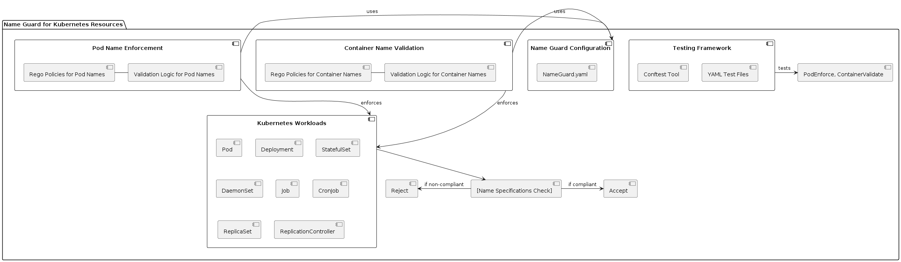

# Name Guard for Kubernetes Resources 🛡️

Welcome to the Name Guard, an essential Open Policy Agent (OPA) project designed to enforce stringent naming conventions within Kubernetes clusters. This project automates the enforcement of name standards, ensuring that pod and container names adhere to Kubernetes best practices and custom organizational rules. 🌟

## Features ✨

- **Pod Name Enforcement**: Ensures that all pod names meet specified length and character constraints, including checks for prefixes and prohibited patterns.
- **Container Name Validation**: Validates container names within pods to ensure they conform to specified naming conventions, including start and end character rules.
- **Comprehensive Coverage**: Applies to a variety of Kubernetes workload kinds, such as Pods, Deployments, and StatefulSets.

## UML Diagram 🌟



## Installation 🚀

To get started with the Name Guard, clone the repository to your local environment or directly into your Kubernetes cluster's management node:

```bash
git clone https://github.com/D-Kumar19/RegoPoilicies-Open-Policy-Agent.git
cd .\RegoPoilicies-Open-Policy-Agent\3) Name Guard\
```

## Usage 🛠️

### Defining Name Configurations

Modify the `NameGuard.yaml` file to specify the naming rules for your Kubernetes workloads:

```yaml
TestParams:
  podNamePrefix: "k8s-"
```

```yaml
TestParams:
  containerNamePrefix: "cnt-"
```

### Running Policy Tests

Utilize the Conftest tool to execute the policy tests defined in your configuration files:

```bash
conftest test -p ./PodNameGuard.rego -p ../utils/utils.rego <template_output>
conftest test -p ./ContainerNameGuard.rego -p ../utils/utils.rego <template_output>
```

## Code Snippets 📝

### Regex for Name Validation

Here is a snippet from `ContainerNameGuard.rego`, demonstrating how we validate the container names:

```rego
# Enforces name length and character constraints
deny[msg] {
    some con in container

    name := con.name
    not re_match(`^(?!-)[a-z0-9-]{1,63}(?<!-)$`, name)
    msg := sprintf("%v in %v: Invalid container name '%v'. Names must be 1-63 characters long, and cannot start or end with a dash!", [name, input.metadata.name, name])
}
```

### Name Start Validation Function

This function ensures names start with the specified prefix, vital for organizational naming conventions:

```rego
deny[msg] {
    some con in container

    name := con.name
    expectedStartName := data.containerNamePrefix

    not re_match(sprintf("^%s", [expectedStartName]), name)
    msg := sprintf("%v in %v: Invalid container name '%v'. Container name must start with '%v'.", [name, input.metadata.name, name, expectedStartName])
}
```

## Contributing 🤝

Your contributions help improve our governance over Kubernetes resources. We appreciate any enhancements you bring, pushing our configurations towards perfection.

If you have a suggestion that would make this better, please fork the repo and create a pull request. You can also simply open an issue with the tag "enhancement".

---
